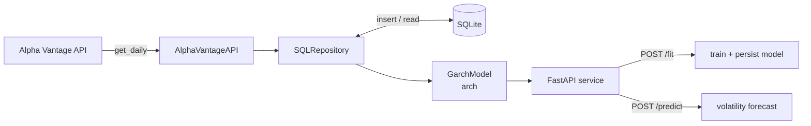

# Volatility Forecasting with GARCH — MTN Group (MTNOY) 🇿🇦

A small but complete pipeline that pulls daily equity data, persists it locally, fits a **GARCH** model to forecast return volatility, and serves the whole thing behind a **FastAPI** service with `/fit` and `/predict` endpoints.

Built as part of the WorldQuant University Applied Data Science Lab. This README is my own write-up of the *concepts* — the engineering and the econometrics — not a copy of the coursework.

---

## What it does

Given a ticker (here, MTN Group's ADR **MTNOY**):

1. **Ingest** — fetch the daily price series from the Alpha Vantage API.
2. **Store** — write it to SQLite through a thin repository layer.
3. **Model** — compute returns, diagnose volatility structure, and fit a GARCH model.
4. **Serve** — expose training and forecasting over HTTP so the model is callable, not just runnable in a notebook.

The output is a *k-day-ahead volatility forecast* — how much the stock is expected to swing, not which direction it'll go.

---

## Architecture



Three layers, deliberately decoupled:

| Layer | Responsibility | Key idea |
|-------|----------------|----------|
| **Data** | `AlphaVantageAPI`, `SQLRepository` | Repository pattern — the model never knows it's talking to SQLite |
| **Model** | `GarchModel` wrapping `arch` | Wrangle → fit → forecast, all behind one object |
| **Service** | FastAPI + Pydantic `FitIn` | Typed, validated requests over HTTP |

---

## Tech stack

`Python` · `arch` (GARCH) · `pandas` / `numpy` · `statsmodels` (ACF/PACF) · `sqlite3` · `requests` · `FastAPI` · `pydantic` / `pydantic-settings` · `matplotlib`

---

## Key learnings

This is the part I actually care about. Three buckets: the econometrics, the software patterns, and the deployment.

### 1. The econometrics of volatility

**Returns, not prices.** Prices are non-stationary; you model *returns* — `pct_change` of close, scaled to percent. Volatility is then just the standard deviation of those returns.

**Daily → annualized scaling.** Annual volatility = daily volatility × √252 (≈252 trading days). The √ comes from variance scaling linearly with time under an i.i.d. assumption, so standard deviation scales with the square root of the horizon.

**Volatility clusters; returns don't autocorrelate.** Raw returns are essentially uncorrelated (markets are roughly efficient), but their *magnitude* is not — big moves cluster with big moves. The clean way to see this:

> Plot the **ACF/PACF of *squared* returns.** Significant lags there are the fingerprint of conditional heteroskedasticity (ARCH effects), and they're the empirical justification for reaching for a GARCH model in the first place.

This was the conceptual click for me: the squared-returns ACF *is the diagnostic*. No significant structure → don't bother with GARCH.

**What GARCH actually models.** A GARCH(p, q) models *conditional variance* as a function of (a) recent squared shocks — the ARCH/α terms — and (b) recent variances — the GARCH/β terms:

```
σ²_t = ω + Σ αᵢ·ε²_{t−i} + Σ βⱼ·σ²_{t−j}
```

GARCH(1,1) is the workhorse for a reason: two parameters capture clustering plus persistence (α+β near 1 ⇒ shocks decay slowly). Higher orders rarely earn their keep — compare with **AIC/BIC**, don't just crank p and q.

**Validating the fit via standardized residuals.** Divide residuals by the model's conditional volatility (`std_resid = εₜ / σₜ`). If the model captured the heteroskedasticity, the ACF of the *squared standardized residuals* should be flat — the structure you saw in the raw squared returns should now be gone. That's the before/after that tells you the model worked.

### 2. Software engineering patterns

**Repository pattern.** `SQLRepository` wraps all the SQLite I/O behind `insert_table` / `read_table`. The modeling code asks for data without knowing or caring where it lives. Swap SQLite for Postgres later and nothing upstream changes — and the data layer is independently testable.

**Test-driven development with mocked APIs.** Instead of hitting Alpha Vantage live (rate limits, flaky responses, non-deterministic data), the external request is **mocked** so every run sees identical bytes. Tests assert on *types* and on the presence of attributes (`hasattr(model, "aic")`) — you specify the contract first, then make it pass.

**Pydantic for request schemas.** `FitIn` defines exactly what a fit request looks like (`ticker`, `p`, `q`, `n_observations`, …). Incoming JSON is validated and coerced into a clean typed object before any logic runs — bad input fails loudly at the boundary, not three functions deep.

**Centralized config.** API keys and DB names live in a `settings` object (env-driven), never hard-coded. Secrets out of source, config in one place.

### 3. APIs & deployment

**Consuming REST properly** — building a query URL from parameters, checking `status_code`, parsing JSON into a DataFrame. Boring, foundational, easy to get subtly wrong.

**Serving the model over HTTP.** Two endpoints make the model an actual service:
- `POST /fit` — train on a ticker's data and persist the fitted model.
- `POST /predict` — load the model and return an n-day volatility forecast.

The notebook talks to it via `requests.post` to `localhost:8008`, which is the same thing any real client would do — the model graduates from "runs in my notebook" to "callable by anyone."

---

## Gotchas that actually bit me

- **Sort the index ascending before `pct_change`.** SQLite read-back isn't guaranteed chronological; if it's reversed, your returns are computed backwards and everything downstream is quietly wrong.
- **Drop the leading NaN.** The first `pct_change` is always NaN — `arch` won't fit with it in.
- **Time-series split is a *slice*, never a shuffle.** `cutoff = int(len(y) * 0.8)` then `y[:cutoff]`. Random splits leak the future into training and are meaningless for a temporal model.
- **`rescale=False` in `arch_model`.** `arch` will silently rescale small-magnitude series, which shifts your coefficients. Turn it off if you want reproducible, interpretable parameters on your own scale.
- **The mock patch stays live across cells.** This one cost me real time: once `requests.get` is patched to a `MagicMock`, it *stays* patched. Run cells out of order or on a stale kernel and the grader sees a `MagicMock` where it expects a real type. Fix: **Restart kernel → Run all, in order.** Most "impossible" grader failures here were execution-order ghosts, not logic bugs.

---

## Running it

```bash
# 1. Start the model service
uvicorn main:app --host 0.0.0.0 --port 8008 --reload

# 2. Fit a model
curl -X POST http://localhost:8008/fit \
  -H "Content-Type: application/json" \
  -d '{"ticker":"MTNOY","use_new_data":false,"n_observations":2500,"p":1,"q":1}'

# 3. Forecast 5 days of volatility
curl -X POST http://localhost:8008/predict \
  -H "Content-Type: application/json" \
  -d '{"ticker":"MTNOY","n_days":5}'
```

---

## One-line summary of the whole thing

> Returns don't autocorrelate but their volatility does — GARCH models that clustering, the squared-returns ACF tells you whether it's worth modeling, and a repository + FastAPI wrapper turns the result into something you can actually call.
